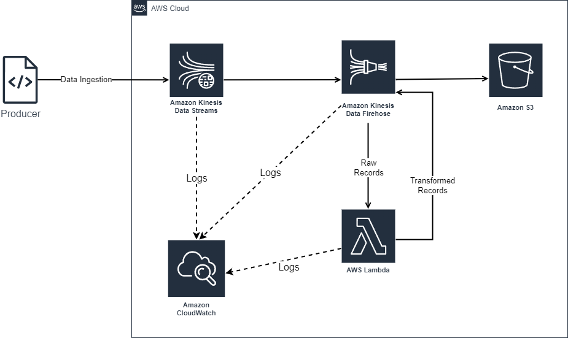

# Data Streaming Assignment

## Architecture Diagram



## Clarifications

* It is assumed that the data being warehoused in S3 does not need to be converted into a columnar data format for the purposes of this assignment.
* Cloudwatch is the primary monitoring, log aggregation and APM tool for this assignment.

## Setup Infrastructure on Local Environment

> [!WARNING]
>
> * The record format presented to the transformation lambda by `localstack` is not the same as the actual one on AWS so things can error out on local.
> * To connect to your actual AWS account please add your account id to the `allowed_account_ids` list in `terraform/main.tf`.

Install AWS cli

```bash
curl "https://awscli.amazonaws.com/awscli-exe-linux-x86_64.zip" -o "awscliv2.zip"
unzip awscliv2.zip
sudo ./aws/install
```

Install jq

```bash
wget https://github.com/jqlang/jq/releases/download/jq-1.7.1/jq-linux-amd64
mv jq-linux-amd64 jq
chmod +x jq
```

Install terrform according to the official installation procedure: <https://developer.hashicorp.com/terraform/install?product_intent=terraform#linux>

Install `pipenv` and other required packages

```bash
pip install pipenv
pipenv install
```

Setup AWS resources using terraform

```bash
pipenv shell
tflocal plan
tflocal apply
```

Create the IAM user for the script

```bash
awslocal iam create-user --user-name stream-user
awslocal iam create-access-key --user-name stream-user > ./infra/credentials.json

export AWS_ACCESS_KEY_ID=$(cat infra/credentials.json | ./infra/jq '.AccessKey.AccessKeyId')
export AWS_SECRET_ACCESS_KEY=$(cat infra/credentials.json | ./infra/jq '.AccessKey.SecretAccessKey')
```

Start record ingestion

```bash
python producer.py
```
